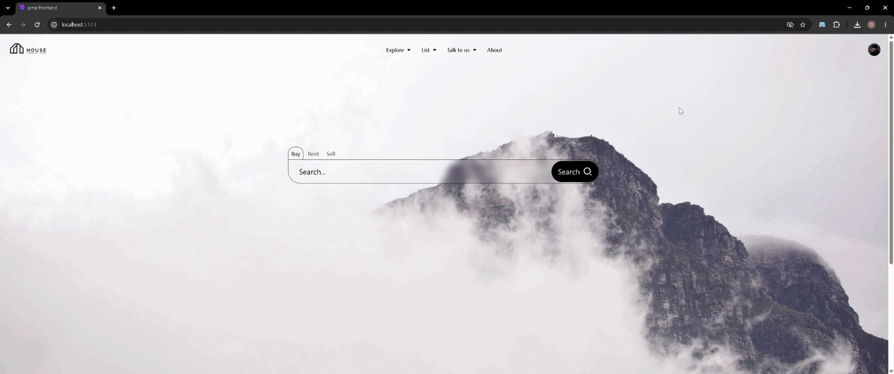
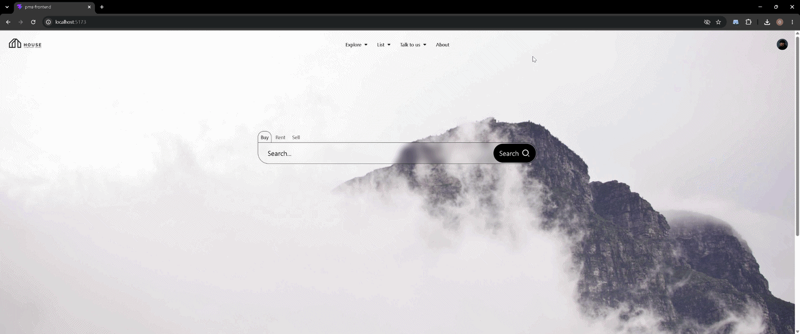
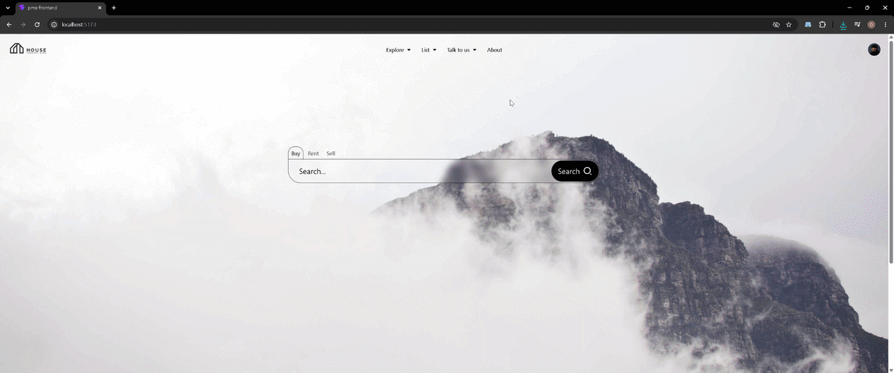
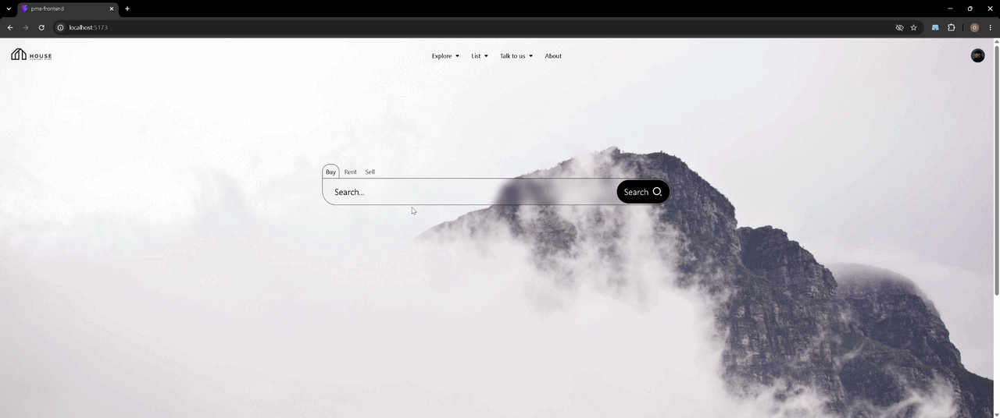

# PMS

Full-stack property management and real-estate platform built with **Java, Spring Boot, React and MySQL**.

Focused on a simple browsing experience and an AI-assisted search that lets users describe what they are looking for instead of manually configuring multiple filters.

> **🚧 Work in progress** — The project is actively being developed. Backend security is already implemented, while the frontend integration is still in progress.

## Showcase

### Navigation

The main navigation provides quick access to the different sections of the platform.



### User Panel

A sliding user panel provides quick access to user-related actions without leaving the current page.



### Property Browsing

A simple flow from the home page to property browsing and then to the property details.



### AI-assisted Search

Users can describe what they are looking for in natural language. The application converts the request into structured search criteria to simplify the search process.



## Features

* Property browsing and detailed listings
* Structured property search and filtering
* AI-assisted natural-language search
* REST API
* Dynamic JPA Specifications
* Responsive React interface
* Backend authentication and authorization with Spring Security and JWT
* Frontend security integration — **in progress**

## Tech Stack

**Frontend**

React · TypeScript · Vite · Tailwind CSS · Axios

**Backend**

Java · Spring Boot · Spring Data JPA · Spring Security · Spring AI · MySQL

## Architecture

```text
React
  ↓
REST API
  ↓
Spring Boot
  ↓
Service / JPA Specifications
  ↓
MySQL

Natural-language search
  ↓
Spring AI
  ↓
Structured search criteria
  ↓
Property search
```

## Repositories

[Frontend](https://github.com/olegbucolo/pms-frontend) · [Backend](https://github.com/olegbucolo/pms)
